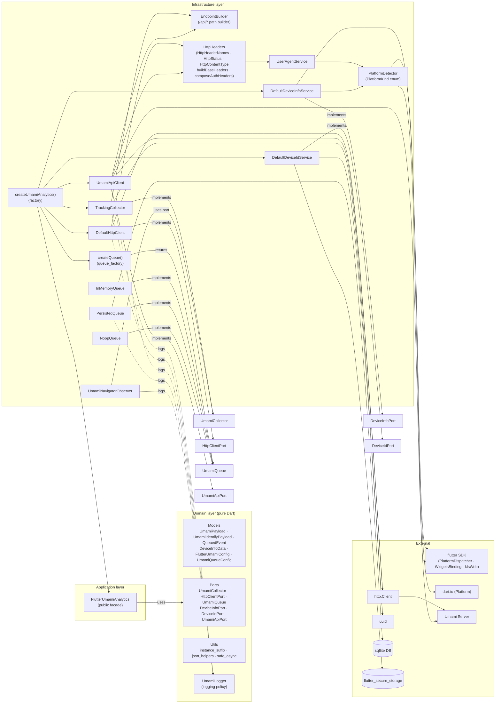
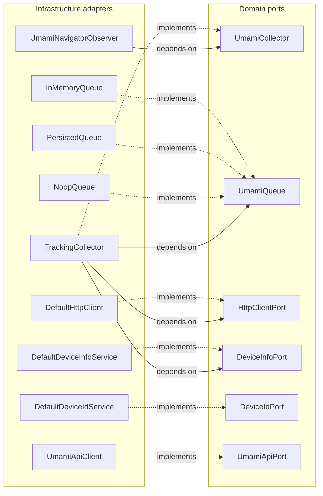
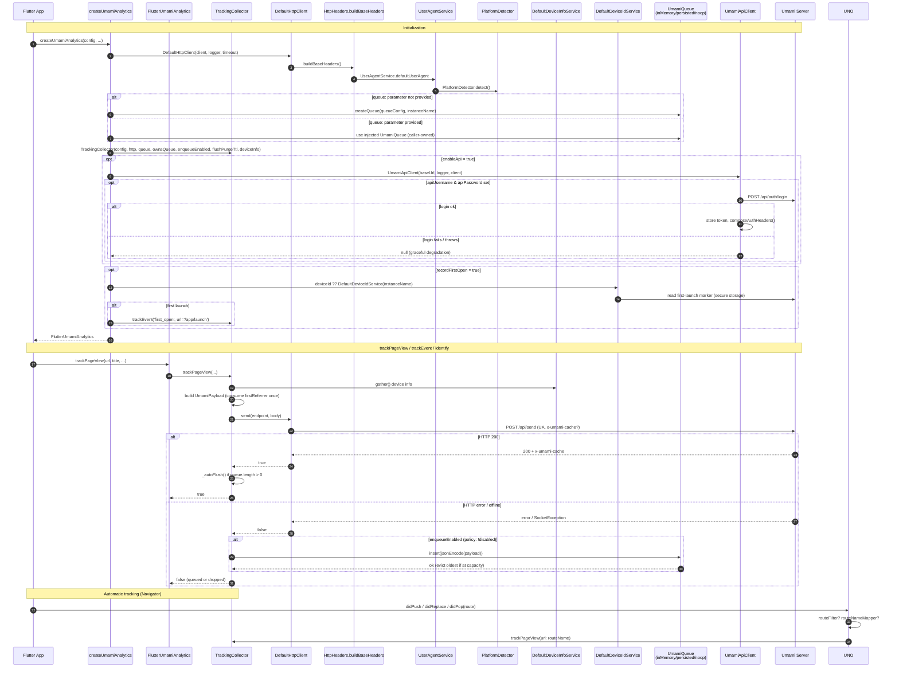
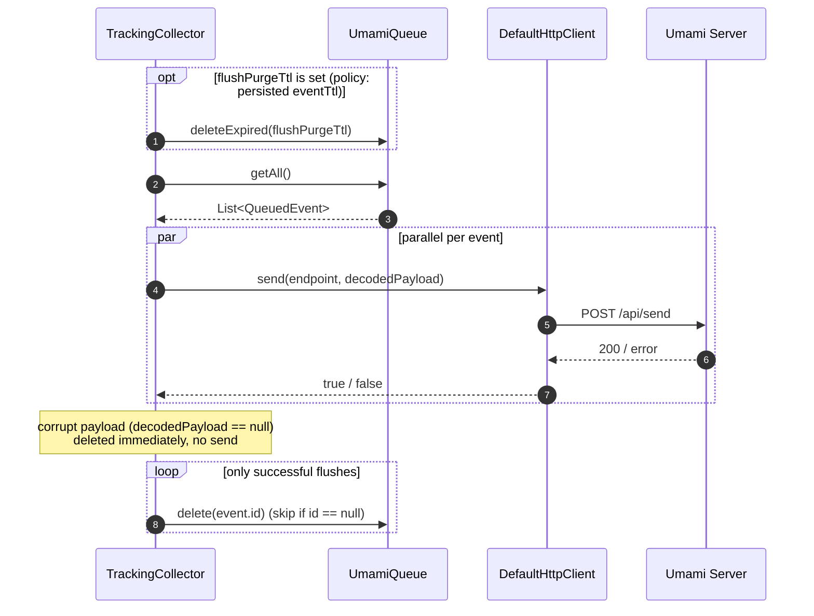
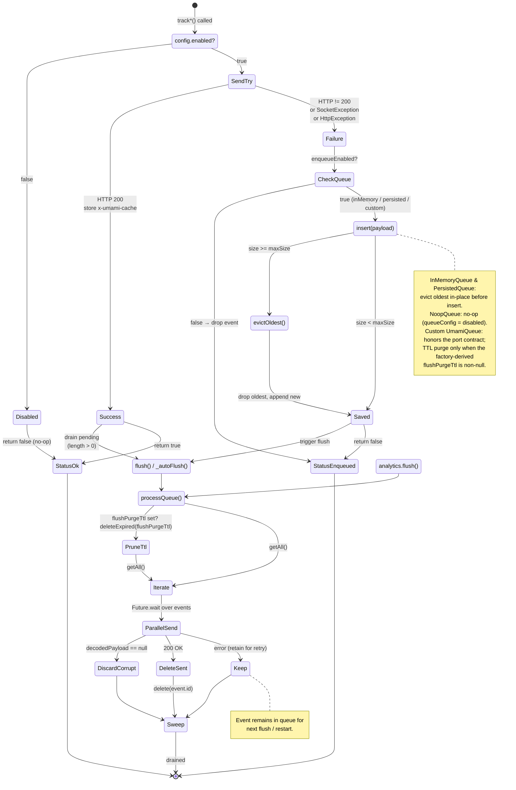
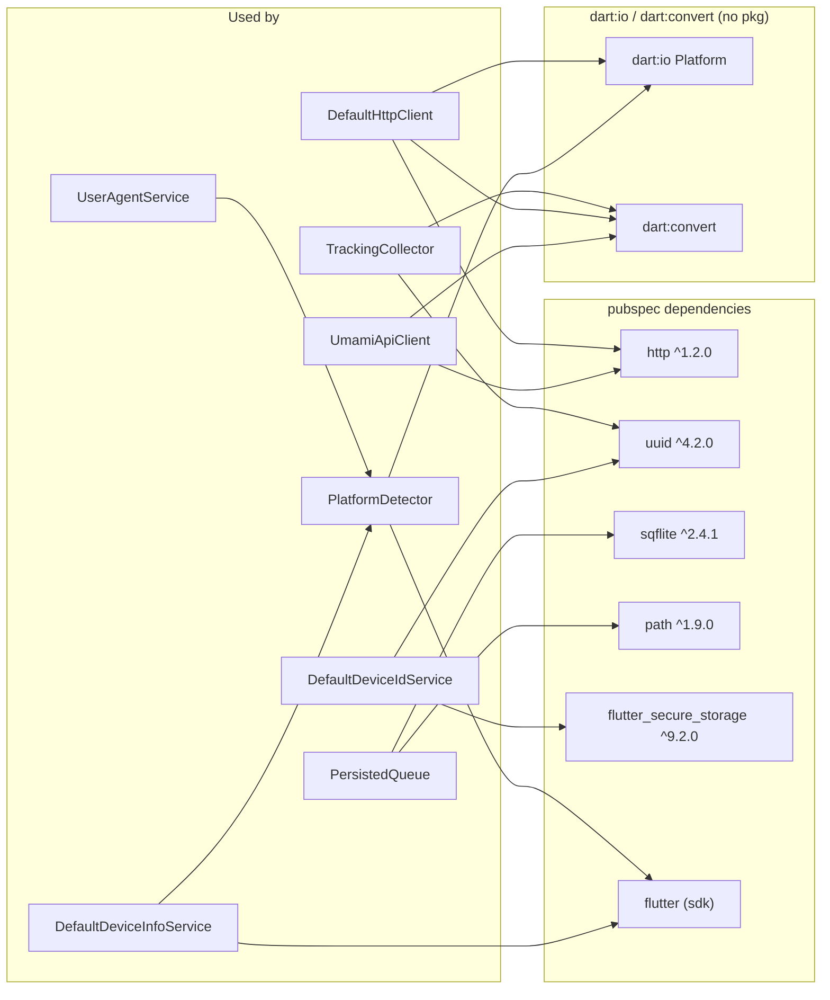

# Architecture Diagram — flutter_umami_analytics

Hexagonal architecture (ports & adapters). Domain is pure Dart, no Flutter/HTTP/DB imports. Infrastructure depends inward (on ports), never the reverse. Queue has 3 selectable modes (`disabled`, `inMemory`, `persisted`); multi-instance isolation via `instanceName`; REST API client is opt-in via `enableApi`.

Note: every adapter that holds a `UmamiLogger?` may emit logs (`TC`, `DHC`, `UAC`, `PQ`, `DDIS`, `DIdS`, `UNO`, `factory`); only the noisiest edges are drawn.

## Ports & Adapters Detail

`FlutterUmamiAnalytics` (facade) holds `UmamiCollector` and an optional `UmamiApiPort? apiClient`; it never touches HTTP or queue adapters directly.

## Tracking Flow

## Flush Detail

`_doFlush()` is the heart of both manual `flush()` and `_autoFlush()` (re-entry guarded by `_flushing`):

`Future.wait` fans out sends in parallel; only events whose send returned `true` are deleted. Events with `decodedPayload == null` (undecodable JSON) are also deleted and skipped. Failed events remain in the queue for the next flush/restart.

## Queue State Machine

## External Dependencies

`EndpointBuilder`, `HttpHeaders`, `instance_suffix`, `json_helpers`, and `safe_async` are pure-Dart helpers with no external package dependency.

## Multi-instance Isolation

`instanceName` flows through `instanceSuffix()` (`_<name>` when non-empty, otherwise `''`) into two places:

- `DefaultDeviceIdService` — secure-storage keys per instance:
  - device id: `umami_device_id_<name>`
  - first-launch marker: `umami_first_launch_<name>`
- `PersistedQueue` — database filename suffix: `umami_queue_<name>.db`. Table name (`queued_events`) and schema are shared; only the file differs.

`InMemoryQueue` and `NoopQueue` are instance-agnostic. `DefaultHttpClient` and `UmamiApiClient` share the same `http.Client` only when the user passes one via the `httpClient` parameter of `createUmamiAnalytics()`; otherwise each creates and owns its own `http.Client` instance (closed on `dispose()`).
